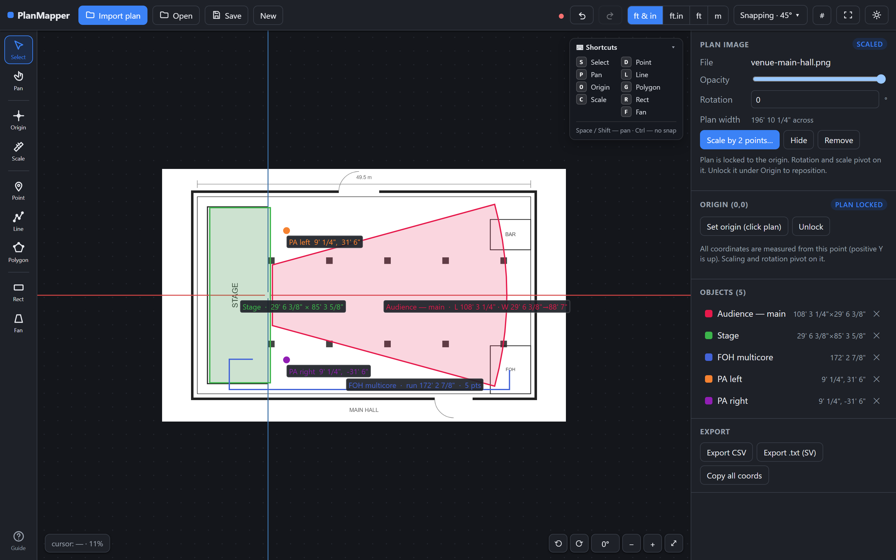
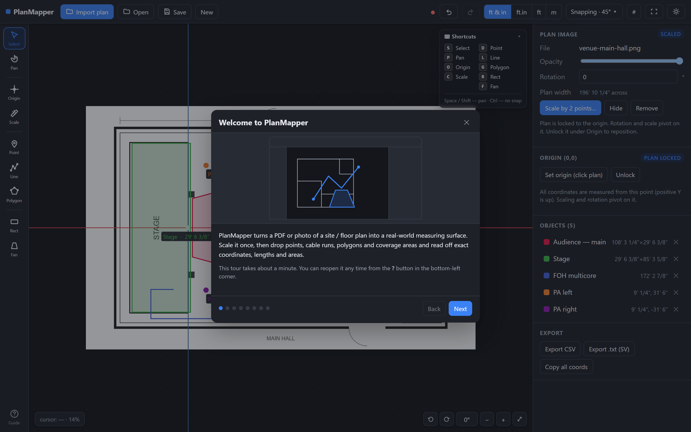
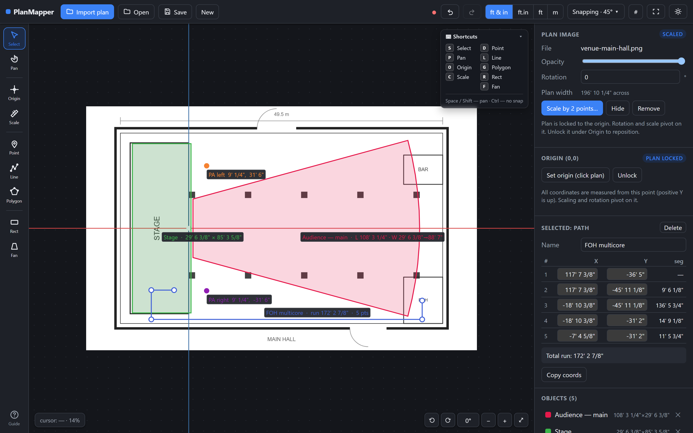
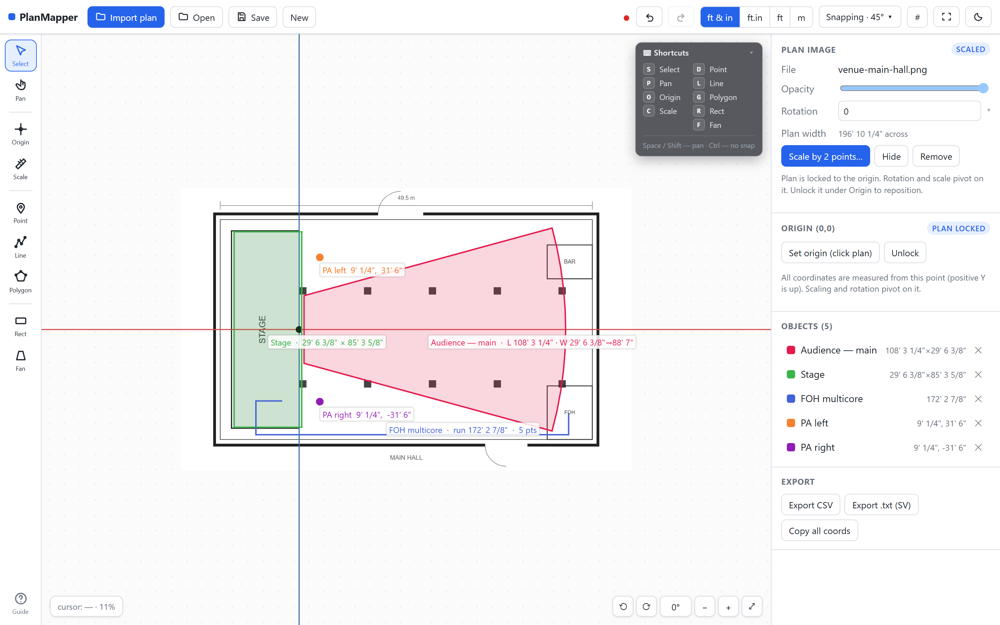

# PlanMapper

**Turn a PDF or photo of a floor plan into a real-world measuring surface.** Scale it
once against a known distance, set a 0,0 origin, then drop points, cable runs, polygons
and coverage areas and read off exact coordinates, lengths and areas. Fully 100% vibe-coded for your pleasure. Thanks Claude!



## Why

Event and production people routinely need to answer "how far is that, and where exactly
is it?" from a venue drawing: cable runs, PA positions, audience coverage, stage
dimensions. The usual workaround is to open photoshop, vectorworks, sketchup or another acoustic sim tool that has image import, and use it
off-label as a measuring tool, which is heavy, awkward, and full of features you don't
want.

PlanMapper does that one job, and does it really well.

## Download

Grab the latest build from the [**Releases**](../../releases/latest) page:

| Platform | File | First launch |
|---|---|---|
| Windows 10/11 | `PlanMapper_<version>_x64-setup.exe` | SmartScreen warning → **More info** → **Run anyway** |
| macOS (Apple Silicon + Intel) | `PlanMapper_<version>_universal.dmg` | **Right-click** the app → **Open** → **Open** |

Both are unsigned. I am not paying for developer liscenses for these because these are tools for my personal use - first. So each OS
shows a scary-looking warning the first time. That's the only thing it means. After the
first launch, both open normally.

## How it works

The whole workflow is four steps, and the app walks you through them on first run
(reopen the tour any time from the **?** button in the bottom-left corner).



**1 · Import** a PDF (any page) or an image — JPG, PNG, WebP. Drag it onto the canvas or
use the Import button. No size limit, no compression.

**2 · Set the origin.** Click the feature on the plan that should read 0,0; stage
centre, a survey mark, a building corner. Drag the origin dot or nudge it with the arrow
keys to land it exactly, then press <kbd>Enter</kbd> to lock the plan to it. Every
coordinate the app reports is measured from here, and both rotation and scaling pivot on
it, so it never drifts.

**3 · Scale by two points.** Click either end of a distance you know; a printed
dimension, a stage width, a standard door — type the real distance, and the whole plan
snaps to real-world size. Re-scaling later is safe: anything already drawn scales with
the plan.

**4 · Draw and measure.** Points for coordinates, multi-point lines for cable runs
(segment and total length), polygons for area and perimeter, and rectangle or fan areas
for audience planes — including fans with arced near and far edges.



Every number in the right-hand panel is editable, so you can trace roughly and then type
exact values. Snapping locks to existing vertices, angle steps and a grid, with
<kbd>Ctrl</kbd> to bypass it for one move; arrow keys nudge by a fine step and
<kbd>Shift</kbd>+arrow by a coarse one.

### Units

Feet and inches (`33' 6"`), Soundvision-style `ft.in` (`11.06` = 11′6″), decimal feet
(`33.500 ft`), or metres — switch at any time and everything reformats live.

### Getting the numbers out

- **Save** a `.planmapper` project — the plan image is embedded, so the file is
  self-contained and reopens exactly as you left it.
- **Export CSV** for a spreadsheet, or **Copy all coords** to paste anywhere.
- **Export .txt** in L'Acoustics Soundvision vertex format (metres, Y-up).

### Light and dark

Dark by default; the toggle is in the top bar.



## Keyboard

Bare letters switch tools — <kbd>S</kbd> Select · <kbd>P</kbd> Pan · <kbd>O</kbd> Origin ·
<kbd>C</kbd> Scale · <kbd>D</kbd> Point · <kbd>L</kbd> Line · <kbd>G</kbd> Polygon ·
<kbd>R</kbd> Rect · <kbd>F</kbd> Fan. Ctrl/Cmd combinations are left to document commands,
so they never collide.

| Key | Action |
|---|---|
| <kbd>Shift</kbd> or <kbd>Space</kbd> (hold) | Pan, from any tool |
| Mouse wheel | Zoom toward the cursor |
| <kbd>Enter</kbd> | Finish the current line/polygon, or lock the plan to the origin |
| <kbd>Esc</kbd> | Cancel the current draw / deselect |
| <kbd>Backspace</kbd> | Remove the last point while drawing |
| <kbd>Delete</kbd> | Delete the selected object |
| Arrows / <kbd>Shift</kbd>+arrows | Nudge selection — fine / coarse |
| <kbd>Ctrl</kbd> (hold) | Bypass snapping |
| <kbd>Ctrl</kbd>+<kbd>Z</kbd> / <kbd>Ctrl</kbd>+<kbd>Y</kbd> | Undo / redo |

## Development

The app is a plain web app — Vite + React 19 + TypeScript, Konva for the canvas, pdf.js
for PDF rendering, Zustand for state — wrapped in [Tauri](https://tauri.app) v2 for the
desktop builds. No app code is Tauri-specific; it runs the same in a browser.

```bash
cd planscale
npm install
npm run dev          # http://localhost:5173
```

```bash
npm run build        # type-check + bundle
npm run app:build    # desktop app for the current platform
```

Building the desktop app needs Rust ≥ 1.85, plus the MSVC C++ build tools on Windows or
the Xcode Command Line Tools on macOS. On macOS, build the universal binary with
`npm run tauri build -- --target universal-apple-darwin` — a plain build is
Apple-Silicon-only.

Releases are built by GitHub Actions (`.github/workflows/release.yml`) for both platforms
on any `v*` tag, so you don't need both machines to cut one.

### Layout

| Path | |
|---|---|
| `planscale/src/core/` | Geometry, units, store, file I/O, export formats |
| `planscale/src/canvas/` | Konva stage, interaction, scene objects |
| `planscale/src/ui/` | Top bar, tool rail, sidebar, walkthrough |
| `planscale/src-tauri/` | Desktop wrapper and packaging config |
| `planscale/HANDOFF.md` | Architecture notes, the coordinate model, packaging gotchas |

The coordinate model is the part worth reading before changing anything —
`planscale/src/core/geometry.ts` and the HANDOFF section that explains world / stage /
screen space and why the plan image rotates about the origin rather than its own centre.
